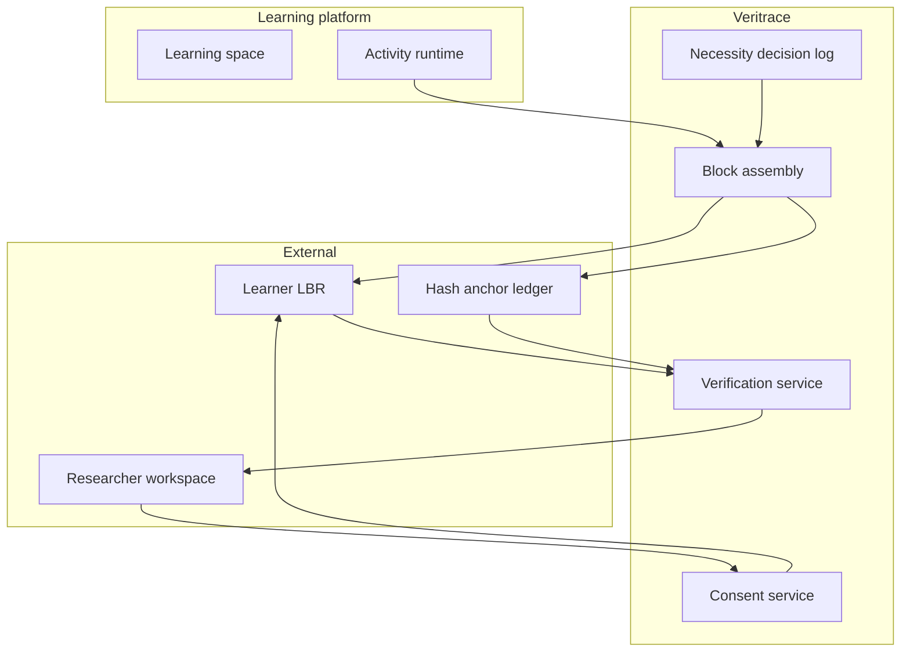

# Veritrace

**Source:** `ai-in-decentralized+ai/trustprivacyandtheblockchain-180708114119/`
**Domain:** `ai-decentralized`
**One-liner:** A privacy-preserving learning-analytics integrity layer that lets learners keep activity traces in their own repositories while researchers verify untampered data against on-chain hashes — without the platform acting as a trusted third party for the raw traces.
**Wedge:** University and EdTech research platforms (Graasp-class learning spaces) that need GDPR-aligned voluntary research datasets and cannot justify storing all learner analytics centrally, yet still must prove authenticity when researchers pull consented exports.
**Positioning:** Integrity without custody. Most LMS analytics keep traces in a vendor database (panoptic risk + GDPR burden). Pure blockchain learning credentials ignore activity-trace research workflows. Veritrace separates **storage** (learner-owned Learning Block Repository) from **integrity** (hash anchored on chain) and forces an explicit “do you even need a blockchain?” decision before fees and latency are incurred.

## Market research synthesis

### Thesis from source

The lecture frames trust (Gambetta: subjective probability another agent will perform an action before monitoring) and privacy (Introna: relational, personal-domain access control; Reinman/Kupfer on selfhood and autonomy) as prerequisites for evaluating blockchain hype. It situates GDPR as granting European residents access, correction, deletion, and consent rights, with fines up to 4% of annual turnover and Fortune-500 compliance costs cited around $16M on average. Cambridge Analytica and panopticism illustrate why “just store everything” learning analytics are ethically and legally fraught. Blockchain is introduced as Iansiti & Lakhani’s shared, tamper-resistant record — and simultaneously as a trough-of-disillusionment technology whose challenges include interdisciplinary skills, unreadable smart contracts for ordinary people, and linking physical identity to on-chain objects (Knottenbelt & Mulligan, WEF).

The actionable case study is Graasp: teachers create learning spaces with resources and labs; students generate activity traces akin to analytics events; researchers want those traces; GDPR pushes the platform not to centralise storage and to rely on voluntary provision. If learners store their own traces, researchers cannot trust integrity on retrieval. Intermediate idea: platform stores a hash before release. Deeper problem: the platform may itself be an untrusted third party (malicious staff, outages — Uber employee abuse cited). Solution pattern: emit a signed **learning block** at activity end to an external Learning Block Repository (LBR), and record the block’s hash on a blockchain for later validation. Retrieval requires owner-granted access; verification compares returned block hash to the chain anchor.

The lecture’s final discipline is as important as the architecture: Wüst & Gervais “Do you need a Blockchain?” flowchart (state? multiple writers? trusted party? known writers? → permissionless vs not). Takeaway: think hard before using a blockchain — fees, latency, open smart-contract exploit surface, and whether end users care. Veritrace productises that pattern as a governed integrity service for education research: optional anchoring, learner-owned storage, consent-gated researcher access, and an explicit decision record when chain write is skipped.

### Buyer & economic model

- **Primary buyer:** VP Product / Research Lead at an EdTech learning-platform vendor, or a university ed-tech / learning-analytics unit operating Graasp-like spaces.
- **Users:** learners (consent and repository linkage), teachers (space configuration), education researchers (analysis access requests), platform privacy officers, integrators.
- **Budget owner / value metric:** research-platform and GDPR compliance budget. Value metric is share of research datasets verified on retrieval, reduction in central PII/trace storage, and time for researchers to obtain consented, integrity-checked extracts.
- **Competing status quo:** central LMS analytics DBs; manual CSV exports with no integrity; generic blockchain credential wallets that ignore fine-grained activity traces; hashing in a vendor DB that recreates the TTP problem.

### Domain constraints

- **Regulatory / trust / safety:** GDPR consent, purpose limitation, deletion rights vs immutable chain hashes (store hashes/commitments carefully — no personal data on chain); minors in education settings need heightened guardianship rules.
- **Data sensitivity:** learning traces reveal behaviour, performance, and sometimes special-category inferences; raw blocks stay off-platform by default.
- **Change-management realities:** learners will not operate crypto wallets for marginal research value; UX must hide chain complexity (managed keys, custodial LBR options) and allow “hash-only / no-chain” modes when the Wüst-Gervais test fails.

## Business requirements

- BR-1: Learners must be able to designate an external Learning Block Repository as the system of record for their activity traces, with the learning platform not required to retain raw traces.
- BR-2: At the end of a learning activity, the system must assemble a signed learning block, deliver it to the learner’s LBR, and optionally anchor a hash commitment on a configured ledger.
- BR-3: Researcher access to a learning block must require owner-granted consent for a stated purpose and time box; access without consent is denied.
- BR-4: On retrieval, every block must be verifiable by recomputing its hash and comparing to the anchored commitment; mismatch fails closed and is logged as a tamper event.
- BR-5: Personal data must never be written to the public ledger — only opaque commitments and non-identifying metadata permitted by policy.
- BR-6: Platforms must record a blockchain-necessity decision (per Wüst-Gervais-style criteria) before enabling chain anchoring for a deployment, including fee/latency acceptance.
- BR-7: Learners must be able to withdraw consent and request deletion of raw blocks from LBR integrations; anchored hashes remain but must be unlinkable to identity after withdrawal per design.
- BR-8: Teachers and researchers must see consent and verification status without receiving unnecessary raw telemetry.
- BR-9: Smart-contract or anchoring adapters must be versioned and auditable; vulnerable open contracts are a named risk and require patch/migration playbooks.
- BR-10: End-user flows must not require learners to understand gas, keys, or forks for the default managed path.
- BR-11: Export packages for research must include verification proofs and consent artefacts suitable for ethics board review.
- BR-12: Success is measured by verified consented exports and reduction in centrally stored trace volume — not by number of chain transactions.

## User stories

Canonical user stories live in sibling [USER_STORIES.md](USER_STORIES.md).

## System design

### Overview

Veritrace sits beside a learning platform. During activities, the platform emits events; at activity close, Veritrace builds a signed learning block, pushes it to the learner’s LBR, and optionally anchors a hash on a ledger after a documented necessity decision. Researchers request access; owners consent; Veritrace fetches, verifies against the anchor, and releases an export with proofs. Deletion and consent withdrawal flow through LBR adapters while preserving unlinkable commitments where legally required.

### Actors & boundaries

- **Actors:** learners, teachers, researchers, privacy officers, platform operators, LBR providers, ledger networks.
- **Trust boundary:** raw learning blocks live in learner-controlled LBRs; the learning platform and Veritrace see events/hashes/consent metadata. The ledger holds commitments only. No single party should be able to alter a block undetected after anchoring.
- **Human-in-the-loop points:** consent grants; blockchain-necessity decision; investigating tamper events; approving new LBR/ledger adapters.

### Core capabilities

1. **Learning-space hooks** — activity lifecycle and event collection interfaces.
2. **Learning-block assembly** — package, sign, deliver to LBR.
3. **Commitment anchoring** — optional hash write with necessity record.
4. **Consent and access grants** — purpose-limited, time-boxed researcher access.
5. **Verification on retrieval** — hash check, fail-closed tamper handling.
6. **Deletion and withdrawal** — LBR deletion requests and unlink procedures.
7. **Research export** — verified bundles with ethics-ready artefacts.

### Conceptual data

- **Primary entities:** Learner, LearningSpace, Activity, LearningBlock, LbrEndpoint, ChainCommitment, NecessityDecision, ConsentGrant, AccessRequest, VerificationResult, TamperEvent, ResearchExport.
- **Critical events:** activity completed, block stored, commitment anchored, consent granted/revoked, block verified or rejected, deletion completed, export issued.
- **Retention / audit needs:** consent and verification logs retained for ethics and GDPR accountability; raw blocks per learner LBR policy; chain commitments immutable by nature.

### Integrations (conceptual)

- **Systems of record:** learning platform (Graasp-class), learner LBR (personal cloud/repo), permissioned or public ledger, university IdP.
- **Upstream signals:** activity trace streams, consent UX, ethics-study registry metadata.
- **Downstream actions:** researcher analytics workbenches, DPIA evidence packs, security incident tickets on tamper.

### High-level architecture

### Success metrics

- **Leading:** % activities emitting learner-owned blocks; consent grant latency; verification success rate; share of deployments with explicit necessity decisions.
- **Lagging:** reduction in centrally stored trace volume; ethics-board acceptance of export packages; tamper incidents detected; GDPR deletion request completion time.

## OpenAPI skeleton

Canonical HTTP surface lives in sibling [openapi.yaml](openapi.yaml). Summarize here:

- **Base path:** `/v1/...`
- **Auth:** API key for platform integration; Bearer JWT for operators and researchers
- **Resource groups:** Spaces, Blocks, Commitments, Consents, Verifications, Exports
