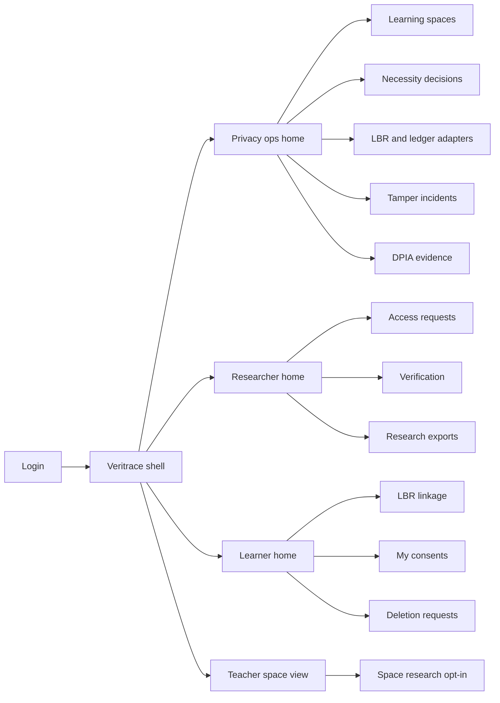
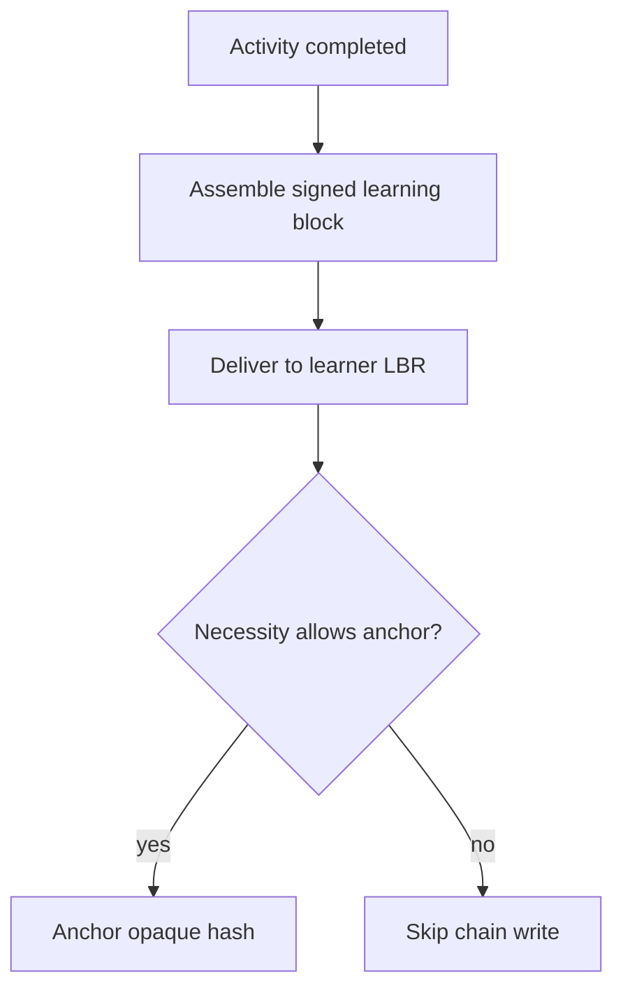
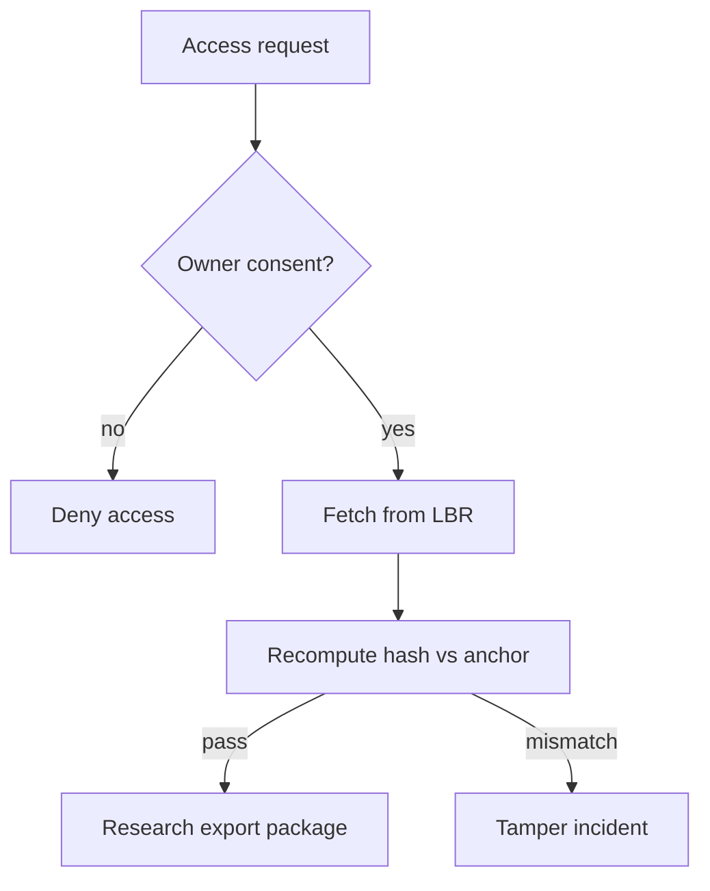

# Veritrace — Web app

**Product:** [PRODUCT.md](./PRODUCT.md)
**Primary surface:** Learning-analytics integrity console (platform privacy ops + researcher verification under one Veritrace shell)
**Secondary surfaces:** Learner consent & LBR linkage (minimal, jargon-free); ethics-board export viewer (read-only proofs); privacy-officer DPIA evidence pack
**Design thesis:** Veritrace is integrity without custody — not a “blockchain learning wallet.” The metaphor is a sealed specimen label: the learner keeps the sample (Learning Block Repository), Veritrace only stamps an opaque hash commitment when a recorded Wüst–Gervais necessity decision says the chain is warranted, and researchers open packages that fail closed on mismatch. Visual language is lab-neutral cool stone and seal-green verification on deep slate; chain chrome is deliberately quiet and optional. The Veritrace wordmark sits as a verification seal on every proof-bearing screen so ethics boards and privacy officers share one authority for “verified, consented, not panoptic.”

## UX research synthesis

### Category peers (best-in-class)

- **Inrupt Enterprise Solid Server / Pod Browser:** Person-controlled storage endpoints, app access grants with purpose. Steal: learner-designated LBR as system of record and time-boxed grants; reject crypto-wallet chrome for the default learner path.
- **Learning Locker / standard LRS consoles (xAPI):** Activity statement pipelines for research analytics. Steal: activity-close → statement/block emission clarity; reject central LRS as permanent panoptic store of raw traces.
- **Blockcerts / Open Badges verification pages:** Recompute hash vs ledger/issuer record, fail closed. Steal: verification-on-retrieval with visible pass/fail and proof export; reject credential-wallet UX that ignores fine-grained activity traces.
- **University ethics / IRB portal patterns (e.g. IRIS, ethics review kits):** Purpose, time box, consent artefacts on every dataset release. Steal: ethics-ready export packages; reject “connect wallet to participate in research” as the primary CTA.

### Patterns to adopt / reject

- **Adopt:** LBR-first storage (platform not required to keep raw traces); optional chain anchor gated by necessity decision record; consent with purpose + time box before researcher fetch; verify-on-retrieval with tamper incident logging; no personal data on ledger; learner revoke/delete without gas literacy; teacher view of consent/verify status without raw telemetry; success metrics as verified consented exports, not tx count.
- **Reject:** Always-on anchoring theatre; public-chain dumps of traces; learner-facing gas/key/fork UI as default; editable verification results; purple “Web3 education” dashboards; measuring success by number of chain transactions (BR-12).

### Trust, density, and workflow constraints from PRODUCT.md

Raw blocks live in learner LBRs; platform/Veritrace hold events, hashes, consent metadata (BR-1, BR-5). Anchoring is optional and must follow a recorded necessity decision including fee/latency acceptance (BR-6). Researcher access is consent-gated and time-boxed (BR-3); retrieval verifies or fails closed (BR-4). Withdrawal deletes raw blocks while leaving unlinkable commitments (BR-7). Teachers must not see blockchain jargon by default (BR-10). Exports carry proofs + consent artefacts for ethics boards (BR-11). Minors need heightened guardianship rules in consent UX. Adapter versioning and patch playbooks for contract risk (BR-9).

## Information architecture

### Nav model

### Roles → default home

| Role | Default home | Why |
|------|--------------|-----|
| Privacy officer | Necessity decisions + DPIA evidence | Chain only when warranted; no PII on ledger (BR-5, BR-6) |
| Platform administrator | Adapters + tamper queue | Pluggable LBR/ledger; integrity incidents |
| Education researcher | Access requests → verify → export | Consented integrity-checked extracts (BR-3, BR-4, BR-11) |
| Learner | LBR linkage + consents | Ownership and revoke without jargon (BR-1, BR-7, BR-10) |
| Teacher / space owner | Space research opt-in status | No silent enrollment; no wallet UI (BR-8, BR-10) |

### Cross-links to OpenAPI resources

| Nav area | OpenAPI tags / resources |
|----------|---------------------------|
| Learning spaces / necessity | Spaces |
| Block emit / LBR delivery | Blocks |
| Hash anchors | Commitments |
| Purpose/time-box grants | Consents |
| Integrity checks | Verifications |
| Ethics-ready packages | Exports |

## Screen inventory

### Privacy ops home

- **Purpose:** Answer “are we reducing central trace custody, and is anchoring on only where necessity is recorded?”
- **Entry:** Default for privacy officers / platform admins.
- **Layout regions:** Brand seal; custody KPI (central raw volume ↓, learner-owned block %); necessity coverage (% spaces with decision); tamper alert rail; adapter health.
- **Primary actions:** Open necessity queue; open tamper incident; open DPIA pack.
- **Empty / loading / error:** Empty = connect first learning-space integration; error = adapter down with runbook.
- **BR / story ties:** BR-1, BR-6, BR-12; privacy officer stories.

### Learning space registry

- **Purpose:** Register Graasp-class spaces, activity hooks, and research collection enablement only where learners opt in.
- **Entry:** Ops nav; teacher deep link.
- **Layout regions:** Space table; hook status; research enabled badge; learner opt-in aggregate (counts only); link to necessity decision.
- **Primary actions:** Register space; toggle research collection (blocked if no opt-in policy); open activity lifecycle config.
- **Empty / loading / error:** Hook failure = activity cannot emit blocks.
- **BR / story ties:** BR-2, BR-8; teacher stories.

### Blockchain necessity decision

- **Purpose:** Force a Wüst–Gervais-style recorded decision before any chain anchoring is enabled — including fee/latency acceptance or explicit skip.
- **Entry:** Space detail; privacy ops queue; blocked when admin tries to enable anchoring without record.
- **Layout regions:** Flowchart-inspired checklist (shared state? multiple writers? trusted party? known writers?); outcome (permissioned / permissionless / no chain); fee/latency acceptance; rationale; signer + timestamp.
- **Primary actions:** Record decision; disable anchoring; schedule review.
- **Empty / loading / error:** Cannot enable Commitments adapter until decision exists.
- **BR / story ties:** BR-6; privacy officer “no theatre” story.

### Learner LBR linkage

- **Purpose:** Let learners designate an external Learning Block Repository without understanding gas, keys, or forks on the managed path.
- **Entry:** Learner home; first-activity prompt.
- **Layout regions:** Plain-language “where your activity traces live”; managed LBR vs self-hosted endpoint; test connection; platform custody notice (“we will not keep raw traces by default”).
- **Primary actions:** Link LBR; switch endpoint; disconnect with deletion prompt.
- **Empty / loading / error:** Unlinked = block emit queues with learner notification, not silent central store.
- **BR / story ties:** BR-1, BR-10; learner stories.
- **Mobile notes:** Single column; large link CTA; no seed-phrase UI.

### Consent grants (learner)

- **Purpose:** Grant researchers time-boxed access for a stated purpose; revoke and request raw-block deletion.
- **Entry:** Learner home; email deep link from researcher request.
- **Layout regions:** Pending requests (purpose, study, window); active grants; revoke; deletion request status; guardianship path for minors.
- **Primary actions:** Approve; deny; revoke; request LBR deletion.
- **Empty / loading / error:** Empty = no pending research requests; deletion adapter fail = retry with ticket.
- **BR / story ties:** BR-3, BR-7; learner GDPR stories.

### Researcher access requests

- **Purpose:** Request purpose-limited access; never fetch without consent.
- **Entry:** Researcher default.
- **Layout regions:** Study metadata; space/activity filters; request form (purpose, time box); status (pending/granted/denied/expired).
- **Primary actions:** Submit request; renew within policy; open verification once granted.
- **Empty / loading / error:** Denied = no silent retry loop; expired grant blocks fetch.
- **BR / story ties:** BR-3, BR-8.

### Verification on retrieval

- **Purpose:** Recompute block hash vs anchored commitment; fail closed on mismatch; log tamper events.
- **Entry:** After consent grant; export wizard step.
- **Layout regions:** Block list; verify status (pass / fail / no-anchor mode); commitment reference (opaque); mismatch detail; “LBR offline” distinct from tamper.
- **Primary actions:** Verify selection; open tamper ticket; proceed to export only on pass (or explicit no-anchor policy path).
- **Empty / loading / error:** Offline LBR = hard fail, not empty activity; mismatch = coral incident state.
- **BR / story ties:** BR-4; researcher integrity stories.

### Research export package

- **Purpose:** Deliver verified bundles with consent artefacts and proofs for ethics board review.
- **Entry:** Verification pass → Export.
- **Layout regions:** Package contents checklist (blocks, verification proofs, consent artefacts, necessity summary); download; share-with-ethics link (read-only).
- **Primary actions:** Generate package; re-verify before download; attach study id.
- **Empty / loading / error:** Block generate if any selected block failed verify.
- **BR / story ties:** BR-11; researcher ethics story.

### Teacher space view

- **Purpose:** Show consent and verification status for a space without raw telemetry or blockchain jargon.
- **Entry:** Teacher login / LMS embed.
- **Layout regions:** Opt-in summary; research collection on/off; “traces learner-owned” plain status; no wallet copy.
- **Primary actions:** Enable collection only with opt-in policy; message class about voluntary research.
- **Empty / loading / error:** Research off by default empty state.
- **BR / story ties:** BR-8, BR-10.

### Tamper incident queue

- **Purpose:** Page security when verification mismatches; treat as operational incidents.
- **Entry:** Ops alert; admin home.
- **Layout regions:** Incident table; block/commitment ids; timeline; assign; resolve with playbook.
- **Primary actions:** Acknowledge; escalate; mark resolved with root cause.
- **Empty / loading / error:** Empty = healthy integrity message.
- **BR / story ties:** BR-4; platform admin story.

### Adapter and contract audit

- **Purpose:** Version LBR and ledger adapters; show patch/migration playbooks for vulnerable contracts.
- **Entry:** Admin nav.
- **Layout regions:** Adapter list (version, health); ledger policy (commitments only); vulnerability banner; migration wizard.
- **Primary actions:** Upgrade adapter; disable anchoring during patch; export audit.
- **Empty / loading / error:** Unversioned adapter = deploy blocked.
- **BR / story ties:** BR-5, BR-9.

### DPIA evidence pack

- **Purpose:** Prove raw traces are not on chain; show necessity decisions and deletion completion metrics.
- **Entry:** Privacy officer nav.
- **Layout regions:** On-chain policy attestation; sample commitment (opaque); deletion SLA; central custody reduction chart.
- **Primary actions:** Generate DPIA PDF; export decision log.
- **Empty / loading / error:** Warn if any adapter ever allowed identifying metadata on ledger.
- **BR / story ties:** BR-5, BR-6, BR-12.

## Key flows

1. **Activity close → learner-owned block** — activity ends → assemble signed block → deliver to LBR → optional anchor if necessity allows; failure: no LBR linked → notify learner, do not silently centralise.

2. **Consented research retrieve** — researcher requests → learner grants purpose/time box → fetch → verify vs commitment → export; failure: deny, expire, mismatch, or LBR offline → fail closed.

3. **Necessity before fees** — privacy officer completes Wüst–Gervais checklist → record decision → enable or permanently skip anchoring for space (BR-6).

4. **Withdraw and delete** — learner revokes consent → LBR deletion request → unlink identity from residual commitments → researcher access expires (BR-7).

5. **Ethics package** — verified blocks + consent artefacts + necessity summary → board-ready download (BR-11).

## Design system

### Tokens (CSS variables)

- `--color-ink: #E6EAEF` — primary text on slate
- `--color-slate-950: #0E1419` — app ground
- `--color-slate-900: #161E26` — panels
- `--color-stone: #A8B0B8` — secondary labels
- `--color-seal: #3FA67A` — verified / consent active (seal green)
- `--color-seal-dim: #1F5C44` — seal on dark
- `--color-amber: #C9922A` — pending consent / necessity incomplete
- `--color-tamper: #D94A3D` — mismatch / incident
- `--color-brand: #B8C5C0` — Veritrace seal accent (quiet, not neon)
- `--font-display: "Literata", serif` — screen titles and ethics headings
- `--font-body: "IBM Plex Sans", sans-serif` — forms and tables
- `--font-mono: "IBM Plex Mono", monospace` — commitment ids, hashes, proof digests
- `--space-1`…`--space-8`: 4px scale
- `--radius-sm: 4px`; `--radius-md: 6px` — lab-sharp, not pill-heavy
- `--motion-seal: 180ms ease-out` — verify pass flash
- `--motion-tamper: 240ms ease-in-out` — mismatch alert
- `--motion-consent: 200ms ease-in-out` — grant state change
- Atmosphere: soft paper-fibre texture on export/ethics panes; slate lab chrome elsewhere; no token-price heroes or purple chain glows.

### Typography & brand

- Literata for ethics/DPIA headings and “Verified” statements; Plex Sans for dense ops; mono for commitments and proofs.
- Veritrace wordmark as a quiet seal left of chrome on every proof/consent view — never replaced by generic “Dashboard.”
- Learner/login shell: brand as hero; one headline (“Your traces, your repository”); one CTA — no gas or wallet education in the first viewport.

### Do / don’t

- **Do:** Gate anchoring on necessity records; fail closed on hash mismatch; keep ledger commitments opaque; hide chain complexity from learners/teachers; attach consent artefacts to every export.
- **Don’t:** Purple Web3 education themes; tx-count vanity KPIs; personal data on chain; editable verify results; seed phrases in default UX; treat missing LBR data as empty valid activity.

### Accessibility & domain trust cues

- Contrast AA+ for seal/amber/tamper on slate; verification state also in text (“Verified”, “Tamper suspected”, “No anchor — policy skip”).
- Live regions announce tamper incidents and consent expiry.
- Focus order: space → necessity → block → consent → verify → export.
- DPIA pack machine-readable for auditors; minors path uses guardian language, not crypto metaphors.

## Component patterns

- **NecessityDecisionForm** — Wüst–Gervais checklist with fee/latency acceptance and skip outcome.
- **LbrLinkCard** — plain-language repository linkage for learners (managed path).
- **ConsentGrantChip** — purpose, time box, active/revoked/expired.
- **VerificationResultRow** — pass/fail/no-anchor with commitment reference.
- **TamperIncidentBanner** — fail-closed retrieval state with ops page link.
- **ResearchExportPack** — proofs + consent artefacts + necessity summary.
- **CustodyReductionMeter** — central raw volume vs learner-owned blocks (BR-12).
- **AdapterVersionBadge** — LBR/ledger adapter version + vulnerability state.
- **TeacherPlainStatus** — research opt-in without blockchain jargon.

## Out of scope for v1 web

- Custodial crypto wallets or in-browser key management for learners; full LMS replacement; credential/diploma wallet (Blockcerts-class) as primary product; public marketplace for buying learning traces; native mobile researcher app; implementing LBR storage itself beyond adapters; always-on mandatory public-chain anchoring.
